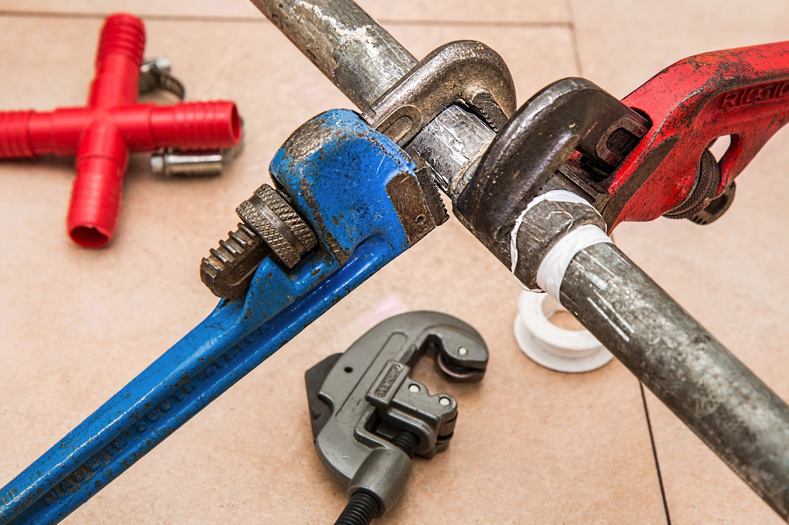
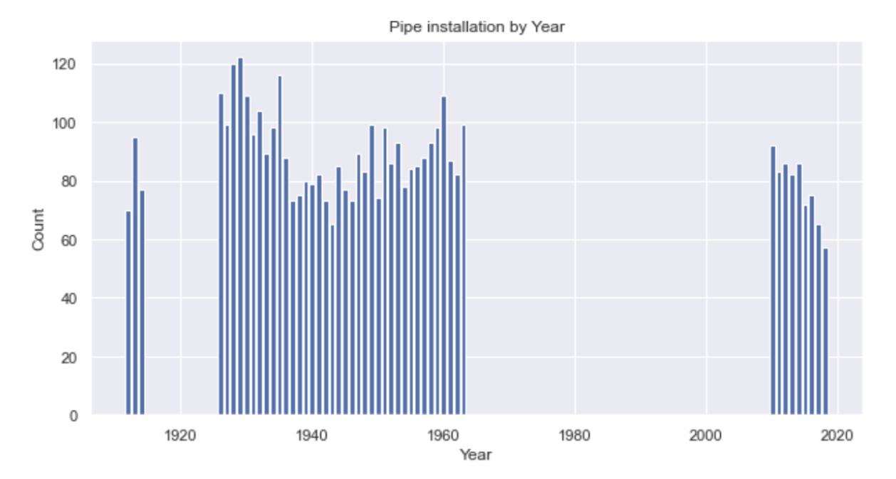
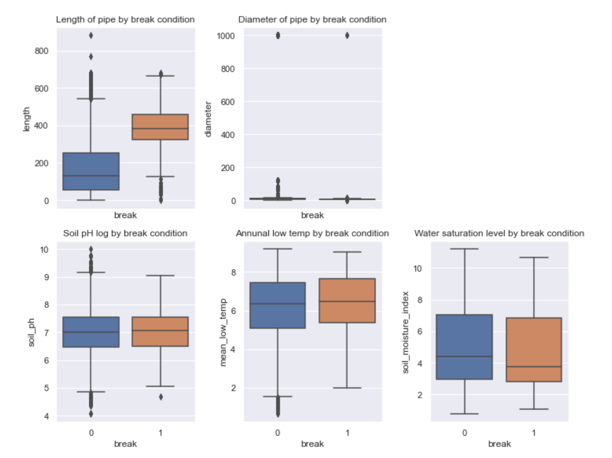

# Water Pipe Network Analysis

Consideration of pipe service life

In this hypothetical scenario, we’re given some dummy client data which closely follows what we typically see in the real world. The goal is to clean and do some basic preprocessing on data, as well as provide some insight into how the data are structured.

https://github.com/Wook22/Pipelife_Analysis/blob/main/Fracta_Coding_Challenge_CHOE.pdf

This project aims to identify weaknesses in water pipe networks, understand the impact of an unplanned failure, and improve the overall reliability of infrastructure to preserve capital.

## Data Description

The project uses two datasets:
- `GM2022 assets.csv`: contains data describing the actual pipes themselves
- `WO EXPORT.csv`: contains data describing past breakages that occurred throughout the pipe network

Impossible values have been converted to null, and all null values have been retained. Extra unnecessary columns in the data were also kept since the required ones are present.

The pipe material has been consolidated into the following categories:
- Cast Iron
- Asbestos Cement
- PVC
- Other

Only the year of installation and breakage is used in the modeling/inference phase. Therefore, the month and date were dropped. Breaks that aren’t due to natural causes were excluded from the analysis.

## Data Visualization

The following bar plot shows the count of pipe installments by year. Based on data the pipes were mostly built from 1930 to 1960. Also, there was a large gap between 1970 to 2010.

Throughout the analysis, there were some characteristics of pipes that have broken. Based on the box plot, many features seem to have a similar distribution between broken or unbroken pipes, but the length of the pipes showed the difference. Also, the material of pipes could affect the pipes break. Pipes were mostly made of cast iron, however, the pipes made of asbestos concrete had the highest proportion of break pipes.

## Model Building

Using the Logistic regression model, possible pipes of failure have been found. Setting the pipe condition as the target variable and setting others as the explanatory variable of the data were trained. However, the prediction rate is low, therefore using other models such as Decision tree and Random forest could be a better option for future analysis.

## Conclusion

The analysis has identified that the age of pipes and their material could affect the probability of breaks. The models built in this project could help predict possible failures in water pipe networks, enabling proactive maintenance and reducing the impact of unplanned failures.
